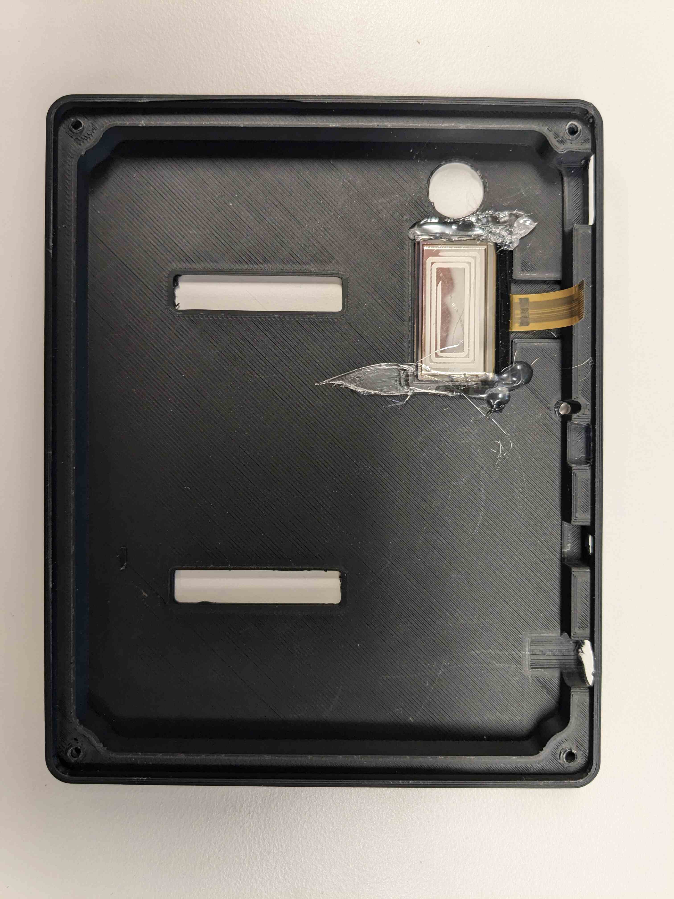
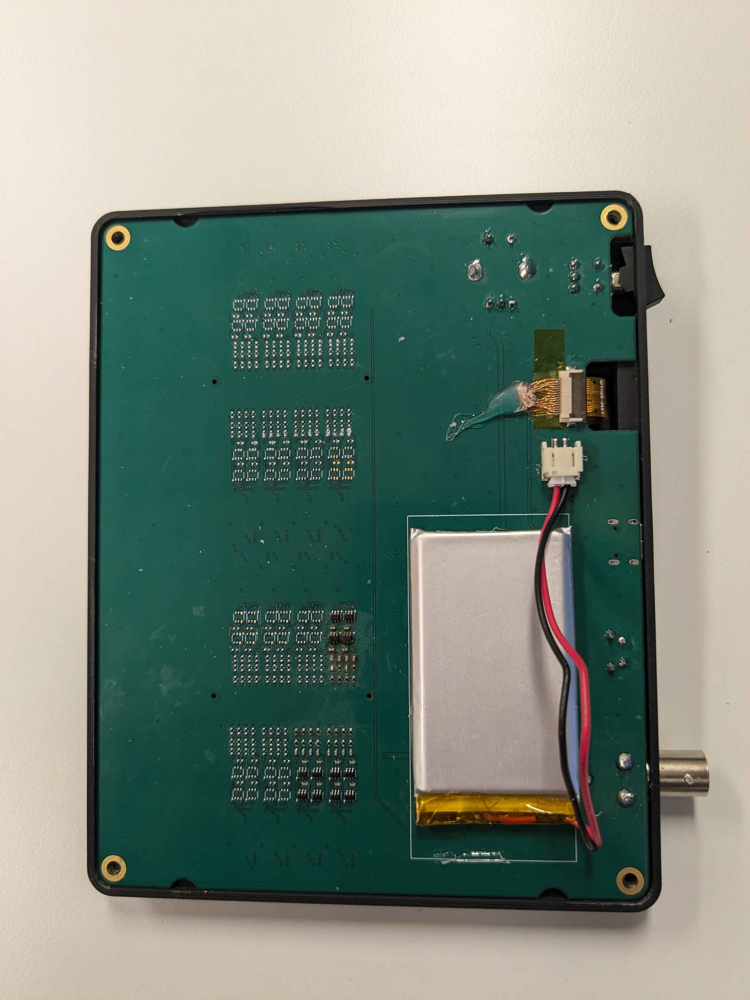
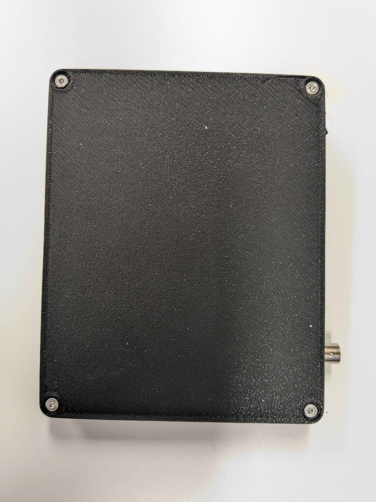
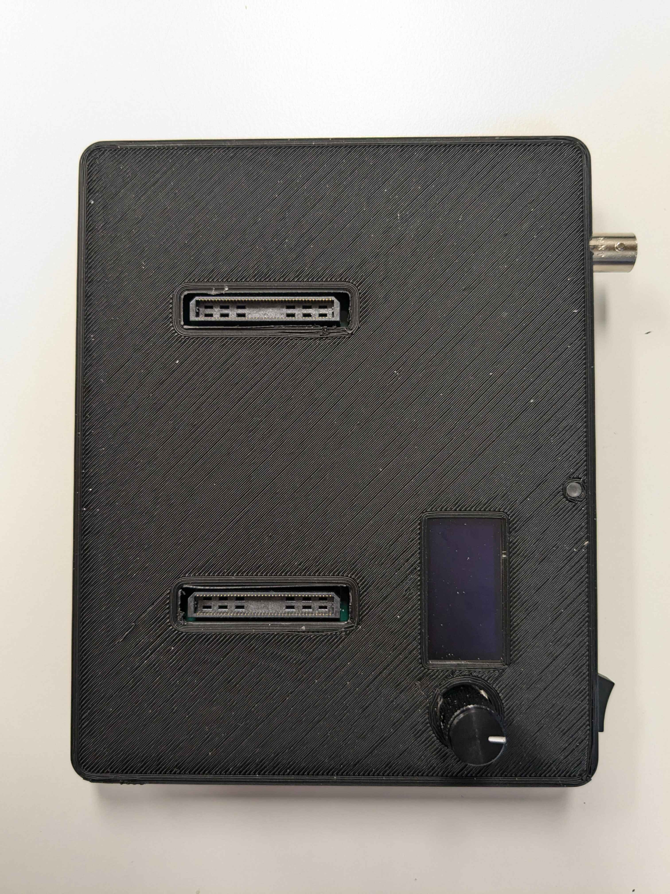

# Device Case Assembly Instructions

Follow these steps to assemble the case for your device, which includes a top lid, bottom lid, and an OLED screen.

## Required Components
- Programmed ephys test board
- [3D-printed base](./case/stl/base.STL) in ABS or Nylon
- [3D-printed top](./case/stl/top.STL) in ABS or Nylon
- OLED screen: [Adafruit 5228](https://www.adafruit.com/product/5228)
- 4x 15mm M3 x 0.5 Flat Head Screws (e.g. [McMaster-Carr 92125A103](https://www.mcmaster.com/92125A103/))
- Battery: [Adafruit 258](https://www.adafruit.com/product/258)
- Rotary encoder knob: [Vishay ACCKMR1316NLT14](https://www.digikey.com/short/5rpqt2rb)
- Light pipe: [Bivar PLPC3-125](https://www.digikey.com/en/products/detail/bivar-inc/PLPC3-125/5721873)
- 2mm Hex driver
- Hot glue gun

## Assembly Steps

1. **Prepare the components**
    Ensure you have all the required components listed above. Place them on a clean, flat surface.

2. **Attach the OLED screen**
    - Plot the top face down.
    - Align the OLED screen with the designated slot or mounting area on the top.
    - Secure the screen in place using hot glue.

3. **Insert the PCB**
    - Insert the PCB in the top.
    - Insert OLED screen's flex cable into the ZIF receptacle and close the latch.
    - Plug in the battery.

4. **Screw on the base**
    - Align the base over the top of the battery so that the battery is contained within its compartment.
    - Fasten the  base to to thje top using 4 screws.

5. **Install the knob and light pipe**
    - Flip the device so its face up.
    - Install the rotary encoder knob using the its included set screw.
    - Press-fit the light pipe into position.

6. **Ensure functionality**
    - Plug in the USB-C connection.
    - Green charging LED should illuminate
    - Flip the power switch to ensure the OLED works.
