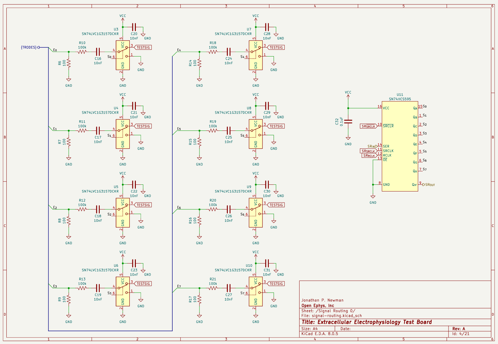
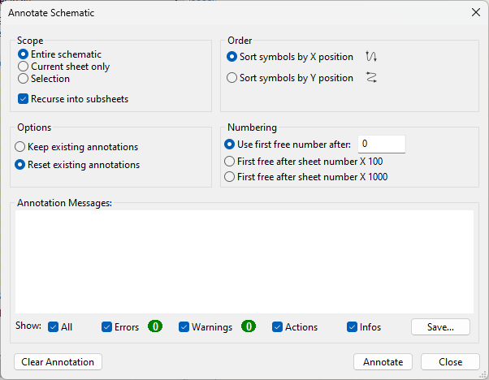
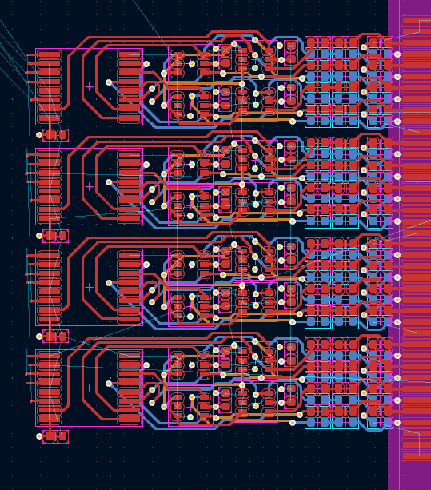
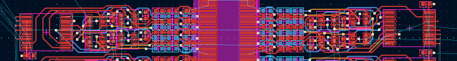
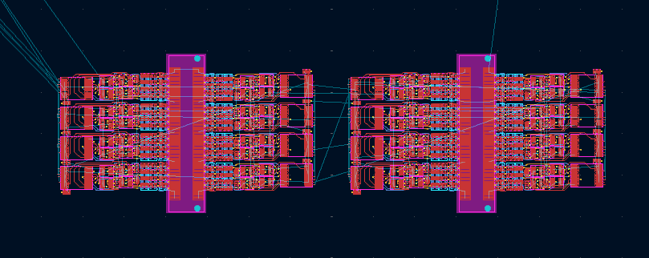

# How to Repeat a Circuit Motif in KiCAD PCB Editor

## Schematic Edits

`signal_routing.kicad_sch` is repeated 16 times in the schematic.

When the design was handed off to me, the reference designator values seemed
random. Instead, I want the largest designator on sheet "Signal Routing n" to be
one less than the smallest designator on sheet "Signal Routing n+1". I also want
to preserve the ordering of reference designators across Signal Routing pages.
For example:

### Page 0

### Page 1

I will explain why I want these requirements in the next section. To satisfy
those requirements, I use KiCAD's "Annotate Schematic..." tool. These are the
settings I used for the e-phys test board:

I _believe_ the behavior of the auto-annotator is to go sheet-by-sheet in the
order of the pages in the schematic hierarchy (TODO: confirm). If this is true,
I think this process is repeatable and not due to some luck in the
auto-annotation process.

## PCB Edits

When I was doing this for the ephys test board, all the footprints were already
on the PCB file. Delete all the footprints except for the ones involved in the
1st instance of the motif. Layout that motif. Select your motif and use the
<kbd>Ctrl</kbd>+<kbd>T</kbd> hotkey to enter the `Create Array` menu. Here are
the settings I used for the e-phys test board:

After the array is created, note that unique reference designators are assigned
to the footprints in the array of motifs. Each motif in the array maintains its
reference designator ordering from the original motif. The reference designator
value of each subsequent motif in the array starts from the largest reference
designator value of the previous motif. That is why I had my requirement from
earlier regarding the reference designators value ordering in the [Schematic
Edits](#schematic-edits) section.

On the ephys test board, there were actually two motifs: one on the left-side of
the connector and one on the right-side. This is because it is not possible to
mirror real parts like we can in the schematic editor, and the motif doesn't
properly map onto the connector like it's supposed to in a way that is 180°
rotationally symmetric. These are the two motifs on either side of the connector

Therefore, in this particular example of the ephys test board, I performed the
above steps in the "PCB Edits" twice, once for each side of the connector.

After one connector is populated with arrays of those two motifs, another array
is created to populate the other connector as well. Here are the settings I used
for the e-phys test board:

"Update PCB from Schematic" to get the all the nets to fix themselves. This is
the result:

